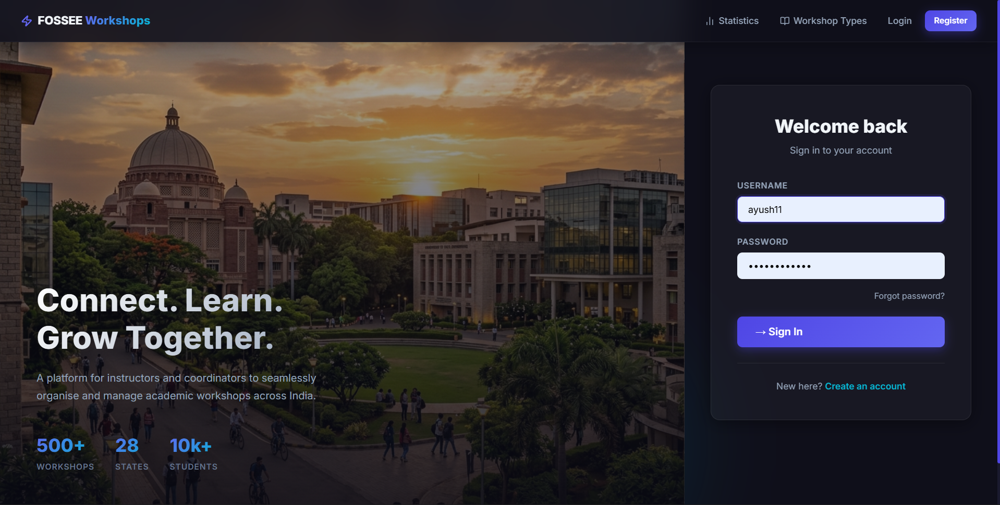
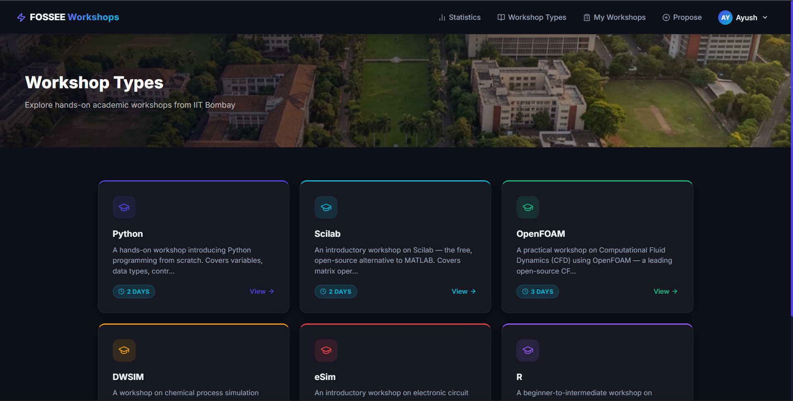
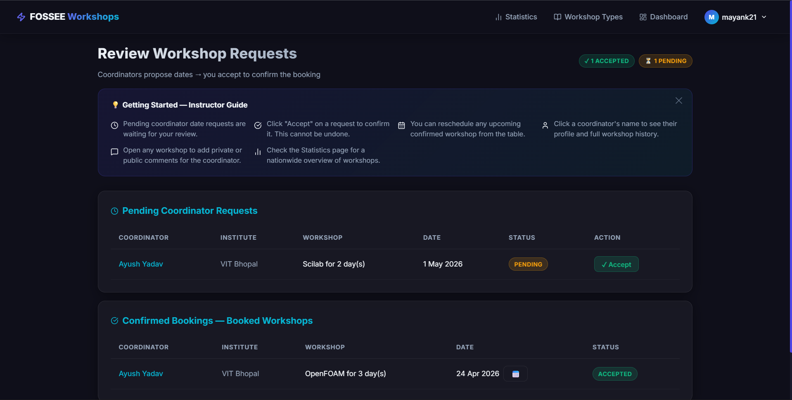
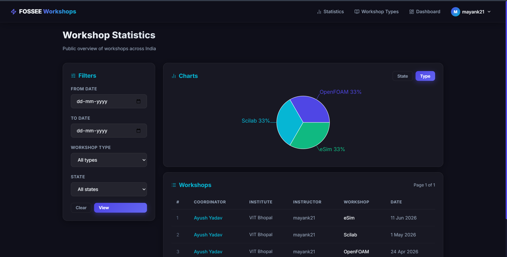

# FOSSEE Workshop Booking Portal

> A full-stack academic workshop management platform built with **React + Vite** and **Django REST** — designed for coordinators and instructors across Indian colleges to organise, propose, and manage FOSSEE workshops.

---

## Table of Contents

- [Visual Showcase](#visual-showcase)
- [Design Principles](#design-principles)
- [Responsiveness](#responsiveness)
- [Trade-offs: Design vs Performance](#trade-offs-design-vs-performance)
- [Most Challenging Part](#most-challenging-part)
- [Overview](#overview)
- [Tech Stack](#tech-stack)
- [How It Works](#how-it-works)
- [Pages & Features](#pages--features)
- [API Reference](#api-reference)
- [Setup Guide](#setup-guide)
- [Usage Walkthrough](#usage-walkthrough)
- [Environment & Configuration](#environment--configuration)

---

## Visual Showcase

The portal was migrated from a legacy Django-template UI (plain HTML with Bootstrap) to a fully decoupled React SPA with a custom dark-mode design system. Below are screenshots of the modernised interface.

### Login Page — Split-panel hero with campus background



*Split-layout with a real campus photo, animated stats, and a glassmorphic login card. The hero hides on mobile and the form takes full width.*

---

### Workshop Types — Hero banner with colour-coded cards



*Aerial campus hero banner + responsive card grid. Each card has a unique accent colour and a Lucide icon. Hovering lifts the card with a smooth shadow transition.*

---

### Instructor Dashboard — Review & confirm coordinator requests



*Coordinators propose dates → the instructor sees them under "Pending Coordinator Requests" and clicks Accept. Confirmed workshops move to "Confirmed Bookings". An onboarding tips panel guides first-time users.*

---

### Statistics — Charts + filterable workshop table



*Public page showing a pie/bar chart of all accepted workshops by type and state, plus a filterable table. The sticky filter panel collapses to a single column on mobile.*

---

## Design Principles

### 1. Hierarchy & Clarity first
Every screen has a single clear primary action. The login page asks you to sign in. The coordinator home page points you to "Propose a Workshop". The instructor dashboard highlights "Review Requests". Clutter and redundant navigation were actively removed — for example, duplicate links that pointed to the same page were consolidated.

### 2. Dark mode by default — premium but accessible
A carefully curated dark palette (`#0f0f1a` background, `#1a1a2e` surfaces, `#4f46e5` indigo primary, `#06b6d4` cyan accent) was chosen for an academic-professional feel. Contrast ratios were maintained throughout — dark overlays (`rgba(8,8,18,0.82)`) ensure text over background images is always legible.

### 3. Glassmorphism — depth without weight
Cards use `backdrop-filter: blur(16px)` with a very-low-opacity white border (`rgba(255,255,255,0.04)`). This creates the illusion of depth without making the UI feel heavy or slow. Solid dark overrides (`rgba(12,12,24,0.94)`) are applied where glass would hurt readability (e.g. the registration form card over a photo background).

### 4. Consistent, purposeful iconography
All icons across the entire portal use **Lucide React** — a single stroke-style icon library. Emoji icons were deliberately removed from every section title, tips panel, and button because they render inconsistently across operating systems and look unprofessional in a formal platform. Every icon choice maps directly to its meaning: `GraduationCap` for instructor, `PenLine` for edit, `SlidersHorizontal` for filters.

### 5. Visual context — campus imagery
Background photos ground the portal in the academic setting it serves. The login hero uses a golden-hour campus shot. The registration page uses the same photo with a heavy dark overlay. The Workshop Types banner uses a different aerial campus view. This variety prevents the site from feeling repetitive while maintaining thematic coherence.

### 6. Process-flow driven navigation
The UI structure mirrors the actual data flow (from the system diagram):
- **Coordinator**: Browse Types → Propose Date → Track Status → Get Confirmed
- **Instructor**: See Coordinator Requests → Accept → Workshop Booked

Section labels ("Proposed Dates — Awaiting Instructor", "Confirmed Bookings — Booked Workshops") were aligned with these exact model names to avoid confusion.

---

## Responsiveness

The portal is fully responsive across mobile (320px), tablet (768px), and desktop (1440px+).

### Strategy

**1. Global CSS grid helpers with cascading breakpoints**
```css
/* 1024px: tablet — 3-col grids reduce to 2 */
@media (max-width: 1024px) {
  .grid-3 { grid-template-columns: repeat(2, 1fr); }
}

/* 768px: mobile — everything goes single column */
@media (max-width: 768px) {
  .grid-2, .grid-3, .grid-4 { grid-template-columns: 1fr; }
  .stats-layout { grid-template-columns: 1fr !important; }
  .detail-two-col { grid-template-columns: 1fr !important; }
}
```

**2. Named utility classes applied per component**
Rather than inline media queries per component, semantic class names (`.stats-layout`, `.detail-two-col`, `.hero-banner-mobile`, `.tips-grid`) are applied to JSX elements and controlled from a single CSS file. This keeps component code clean and the responsive rules maintainable in one place.

**3. Navbar mobile drawer**
On screens ≤ 768px the horizontal nav collapses into a hamburger menu. The drawer uses `transform: translateY(-112%)` + `opacity: 0` to animate offscreen, with `z-index: 999` to overlay content. It supports scrolling for long link lists (`max-height: calc(100vh - 64px); overflow-y: auto`).

**4. Login / Registration special handling**
- Login: the campus hero panel hides entirely on ≤ 900px (via `display: none`). The form takes full width. Body scroll is re-enabled via a CSS class added at the breakpoint.
- Registration: uses `background-attachment: fixed` on desktop but degrades gracefully on mobile where fixed attachment is not supported.

**5. Tables always horizontally scrollable**
All `<table>` elements are wrapped in `<div style={{overflowX:'auto'}}>` so they scroll on narrow screens rather than breaking the layout.

**6. Viewport meta tag**
```html
<meta name="viewport" content="width=device-width, initial-scale=1.0" />
```
This is present in `index.html`, enabling the browser's mobile rendering mode.

---

## Trade-offs: Design vs Performance

| Decision | Design Benefit | Performance Cost | Mitigation |
|---|---|---|---|
| **`backdrop-filter: blur()`** on all cards | Premium glass effect | GPU-intensive on low-end devices | Applied only to cards, not full-page elements; skipped when solid background suffices |
| **Campus background images** (PNG, ~500KB each) | Real academic atmosphere | Increases initial page load | Images are served from `/public/` by Vite's static server; browser caches after first load |
| **`background-attachment: fixed`** on register page | Parallax scroll feel | Disabled by mobile browsers (performance reason) | Gracefully degrades to `scroll` on mobile |
| **Lucide React icons** (tree-shaken) | Consistent, crisp at any size | Small JS bundle addition (~30KB gzip) | Only named imports are bundled — unused icons are eliminated by Vite's tree-shaking |
| **Recharts** for statistics | Interactive hover tooltips, animation | Largest dependency (~150KB gzip) | Loaded only on the `/statistics` route; could be lazy-loaded in a production build |
| **Google Fonts (Inter)** via CDN | Typography quality | Extra DNS + download request | Font is `display=swap` so text renders immediately with a fallback while Inter loads |
| **`backdrop-filter` on navbar** | Glass frosted-glass look | Same GPU cost as cards | Navbar is a single element — cost is minimal |

**Key principle applied:** Performance budget was prioritised for interactions (accept/propose/filter) which are all handled by lightweight Django JSON endpoints with no heavy ORM joins beyond what's needed. The visual richness is front-loaded at page load rather than during user interactions.

---

## Most Challenging Part

### Challenge: Decoupling authentication state and navigation without a redirect loop

**The problem:** The portal needs to support three URL states simultaneously:
1. Public pages (`/types`, `/statistics`) — no auth needed
2. Protected pages (`/home`, `/status`, `/dashboard`) — redirect to `/login` if not authenticated
3. Role-protected pages (`/dashboard`) — redirect to `/home` if authenticated but not an instructor

With React Router v6, getting this right without creating redirect loops (`/` → `/home` → `/login` → `/` → …) required careful sequencing of the auth check.

**Approach:**
```jsx
// App.jsx — root redirect
<Route path="/" element={
  user ? <Navigate to="/home" replace /> : <Navigate to="/login" replace />
} />

// ProtectedRoute — waits for auth loading to complete
if (loading) return <Loader fullPage />;
if (!user) return <Navigate to="/login" replace />;
if (requireInstructor && !user.is_instructor) return <Navigate to="/home" replace />;
```

The `replace` flag on all redirects prevents the back-button from bouncing the user between redirect targets. The auth provider fetches CSRF first, then `/auth/user/`, and only sets `loading = false` after both resolve — so `ProtectedRoute` never sees a false-negative unauthenticated state.

**Second challenge: Email failures silently breaking workshop acceptance**

The accept endpoint was calling `send_email()` — which connects to an SMTP server — synchronously in the request cycle. In a development environment without SMTP configured, this threw an exception *after* `workshop.save()`, causing a 500 response. The frontend showed "Failed to accept workshop" even though the database record was already saved correctly.

**Fix:** Wrapped all `send_email()` calls in `try/except Exception: pass` blocks across all three write endpoints. The database operation always commits first; emails are best-effort side effects.

```python
workshop.status = 1
workshop.instructor = request.user
workshop.save()          # always succeeds
try:
    send_email(...)      # silently skipped if SMTP not configured
except Exception:
    pass
return json_ok(...)      # always returns 200
```

---

## Overview

The **FOSSEE Workshop Booking Portal** is a platform where:

- **Coordinators** (college faculty/staff) browse available workshop types, propose workshop dates for their institute, and track the status of their submissions.
- **Instructors** (FOSSEE team, IIT Bombay) review incoming date proposals from coordinators, accept or reschedule them, and manage their workshop calendar.
- **Public users** can browse workshop types and view the statistics page — no login required.

Email notifications are sent at every key event (when supported by SMTP configuration).

---

## Tech Stack

| Layer | Technology |
|---|---|
| **Frontend** | React 18, Vite, React Router v6 |
| **Styling** | Vanilla CSS — custom dark-mode design system, Inter font |
| **Icons** | Lucide React (stroke-style, tree-shaken) |
| **Charts** | Recharts (bar + pie charts on statistics page) |
| **State / Auth** | React Context API + Django session cookies |
| **Backend** | Django 4.x — custom JSON API views (no DRF) |
| **Database** | SQLite (development) |
| **Email** | Django `send_mail` via SMTP (optional for dev) |

---

## How It Works

### User Roles

| Role | Access |
|---|---|
| **Coordinator** | Register → Browse workshop types → Propose a date → Track status → Get confirmed |
| **Instructor** | Login → Review date requests → Accept → Manage schedule |
| **Public** | Browse workshop types & view statistics — no account needed |

Role is determined by Django group membership. Users in the `instructor` group are instructors; all others are coordinators.

### Workshop Lifecycle

```
Admin creates WorkshopType (Python, Scilab, OpenFOAM…)
          ↓
Coordinator selects a type and proposes a date
          ↓ (ProposeWorkshopDate)
Instructor sees the request on the Dashboard
          ↓
Instructor clicks Accept
          ↓ (BookedWorkshop)
Both parties are notified. Coordinator sees status → Confirmed.
```

The instructor can also **reschedule** any upcoming confirmed workshop, triggering a new notification.

### Registration Flow

Registration uses a **3-step wizard**:

```
Step 1 — Account          Step 2 — Personal         Step 3 — Institute
────────────────          ─────────────────         ──────────────────
Username                  Title                     Institute / Organisation
Email                     First & Last Name         Department
Password                  Phone Number              City / Location
Confirm Password          How did you hear?         State
```

Each step validates before advancing. On final submit, the backend creates the user + profile, auto-verifies the account (dev mode), and redirects to login.

---

## Pages & Features

| Page | Path | Access | Description |
|---|---|---|---|
| **Login** | `/login` | Public | Split-panel hero + username/password auth |
| **Register** | `/register` | Public | 3-step wizard with live validation |
| **Activate** | `/activate` | Public | Email link verification |
| **Home** | `/home` | Auth | Role-aware dashboard with workflow guide |
| **Workshop Types** | `/types` | Public | Paginated card grid of all available workshops |
| **Type Detail** | `/types/:id` | Public | Full description, duration, terms & conditions |
| **My Proposals** | `/status` | Coordinator | Proposed dates + confirmed bookings |
| **Propose** | `/propose` | Coordinator | Select type + date → submit |
| **Dashboard** | `/dashboard` | Instructor | Pending requests + confirmed bookings + reschedule |
| **Workshop Detail** | `/workshops/:id` | Auth | Full info, comment thread |
| **Profile** | `/profile` | Auth | View / edit personal + institute details |
| **Coordinator Profile** | `/profile/:id` | Instructor | Coordinator's details + workshop history |
| **Statistics** | `/statistics` | Public | Charts + filterable table of all confirmed workshops |

---

## API Reference

All endpoints live under `/api/v1/`. The React frontend uses an Axios client that automatically attaches the CSRF token and session cookie.

| Method | Endpoint | Auth | Description |
|---|---|---|---|
| `GET` | `/auth/csrf/` | Public | Bootstrap CSRF token |
| `GET` | `/auth/user/` | Public | Current session user |
| `POST` | `/auth/login/` | Public | Username + password login |
| `POST` | `/auth/logout/` | Any | Logout |
| `GET` | `/auth/activate/<key>` | Public | Verify email |
| `POST` | `/register/` | Public | Create coordinator account |
| `GET` | `/choices/` | Public | Dropdown options (states, depts, titles) |
| `GET` | `/workshops/types/` | Public | Paginated list of workshop types |
| `GET` | `/workshops/types/<id>/` | Public | Workshop type detail |
| `GET` | `/workshops/status/` | ✅ Login | Workshops for current user |
| `POST` | `/workshops/propose/` | ✅ Coordinator | Submit a new workshop proposal |
| `POST` | `/workshops/accept/<id>/` | ✅ Instructor | Accept a coordinator's proposal |
| `POST` | `/workshops/change-date/<id>/` | ✅ Instructor | Reschedule a confirmed workshop |
| `GET/POST` | `/workshops/<id>/` | ✅ Login | Workshop detail + add comment |
| `GET` | `/profile/` | ✅ Login | Own profile |
| `POST` | `/profile/update/` | ✅ Login | Update own profile |
| `GET` | `/profile/<user_id>/` | ✅ Instructor | View a coordinator's profile |
| `GET` | `/api/v1/stats/public/` | Public | Statistics data (charts + table) |

---

## Setup Guide

### Prerequisites

| Tool | Version |
|---|---|
| Python | 3.10 or higher |
| Node.js | 18 or higher |
| npm | 8 or higher |
| Git | Any recent version |

---

### Step 1 — Clone the repository

```bash
git clone <repository-url>
cd workshop_booking
```

---

### Step 2 — Create a Python virtual environment

```bash
# Create the virtual environment
python -m venv .venv

# Activate it
# On Windows:
.venv\Scripts\activate

# On macOS / Linux:
source .venv/bin/activate
```

You should see `(.venv)` in your terminal prompt.

---

### Step 3 — Install Python dependencies

```bash
pip install -r requirements.txt
```

---

### Step 4 — Configure local settings

```bash
# Copy the sample environment file
copy .sampleenv local_settings.py      # Windows
# cp .sampleenv local_settings.py      # macOS/Linux
```

Open `local_settings.py` and set at minimum:

```python
SECRET_KEY = 'any-random-secret-string-here'

# Email — leave blank for development (emails will silently fail, all other
# functionality works normally without SMTP configured)
EMAIL_HOST = 'smtp.gmail.com'
EMAIL_PORT = 587
EMAIL_USE_TLS = True
EMAIL_HOST_USER = ''
EMAIL_HOST_PASSWORD = ''
SENDER_EMAIL = ''
ADMIN_EMAIL = ''
PRODUCTION_URL = 'http://localhost:8000'
```

> **Note:** Email is optional for local development. Workshop acceptance, proposals, and all other features work without SMTP — email sending is silently skipped if not configured.

---

### Step 5 — Apply database migrations

```bash
python manage.py migrate
```

---

### Step 6 — Create an admin / superuser account

```bash
python manage.py createsuperuser
```

Follow the prompts to set a username, email (optional), and password.

---

### Step 7 — Load workshop type fixtures

```bash
python manage.py loaddata workshop_app/fixtures/workshop_types.json
```

This populates the database with the initial set of workshop types (Python, Scilab, OpenFOAM, R, etc.).

---

### Step 8 — Start the Django backend

```bash
python manage.py runserver
```

Django API is now running at **http://127.0.0.1:8000**

---

### Step 9 — Install frontend dependencies (new terminal)

Open a **new terminal window**, activate the virtual environment if needed, then:

```bash
cd frontend
npm install
```

---

### Step 10 — Start the React frontend

```bash
npm run dev
```

React app is now running at **http://localhost:5173**

Vite auto-proxies all `/api/` requests to Django on port 8000 — no CORS issues.

---

### Step 11 — Open the portal

Open **http://localhost:5173** in your browser.

---

## Usage Walkthrough

### As an Admin — Creating workshop types and instructor accounts

1. Go to **http://127.0.0.1:8000/workshop/admin/** and log in with your superuser credentials.
2. Under **Workshop App → Workshop Types**, click **Add** to create a new workshop type. Fill in name, description, and duration.
3. To create an instructor account:
   - Go to **Auth → Users → Add User**, create the account with a username and password.
   - Then go to **Auth → Groups** and add this user to the `instructor` group.
   - Go back to **Workshop App → Profiles** and ensure the user has a profile (it auto-creates on first login).

---

### As a Coordinator — Proposing a workshop

1. Navigate to **http://localhost:5173** and click **Register**.
2. Complete the 3-step registration form:
   - **Step 1**: Enter username, email, password.
   - **Step 2**: Enter your name, phone, and how you heard about FOSSEE.
   - **Step 3**: Enter your institute, department, city, and state.
3. Click **Create Account**. You are automatically logged in.
4. On the **Home** page, click **Browse Workshop Types** to explore available workshops.
5. When ready, click **Propose a Workshop** from the navbar or Home page.
6. Select a workshop type from the dropdown, pick your preferred date, and click **Submit Proposal**.
7. Go to **My Proposals** (via navbar → My Workshops) to track your submission.
8. Once an instructor accepts, the workshop moves to **Booked Workshops — Confirmed by Instructor** with full instructor and date details.
9. Click any workshop row or link to see the full Workshop Detail page with coordinator & instructor contact info.
10. You can leave comments on any workshop from the detail page.

---

### As an Instructor — Reviewing and accepting proposals

1. Log in at **http://localhost:5173/login** with your instructor credentials.
2. You are taken to the **Home** page. Click **Review Requests** or navigate to **Dashboard** from the navbar.
3. The **Pending Coordinator Requests** table lists all proposals waiting for review — showing coordinator name, institute, workshop type, and proposed date.
4. Click **✓ Accept** on any row. The workshop is immediately confirmed in the database.
5. The accepted workshop moves to **Confirmed Bookings — Booked Workshops** below.
6. To reschedule an upcoming confirmed workshop, click the 📅 calendar button next to its date, enter a new date, and click **Save**.
7. Click a coordinator's name to view their full profile and workshop history.
8. Click any workshop link to open the Workshop Detail page where you can add private or public comments.

---

### Viewing Statistics (anyone, no login needed)

1. Navigate to **http://localhost:5173/statistics**.
2. The page loads all confirmed workshops automatically.
3. Use the **Filters panel** on the left to narrow by date range, workshop type, or state.
4. Toggle between **State** (bar chart) and **Type** (pie chart) views using the buttons above the chart.
5. Click any row in the workshops table to open the full Workshop Detail page.

---

## Environment & Configuration

Full reference for `local_settings.py`:

```python
SECRET_KEY = 'your-secret-key'

# Email (optional in development)
EMAIL_HOST = 'smtp.gmail.com'
EMAIL_PORT = 587
EMAIL_USE_TLS = True
EMAIL_HOST_USER = 'your-email@gmail.com'
EMAIL_HOST_PASSWORD = 'your-app-password'   # Gmail App Password, not your account password
SENDER_EMAIL = 'your-email@gmail.com'
ADMIN_EMAIL = 'admin@example.com'
PRODUCTION_URL = 'http://localhost:8000'

# For production only
ALLOWED_HOSTS = ['yourdomain.com', 'www.yourdomain.com']
DEBUG = False
```

> **Gmail App Password:** If using Gmail, enable 2-factor authentication, then generate an App Password at https://myaccount.google.com/apppasswords. Use that instead of your Gmail password.

---

## Project Structure

```
workshop_booking/
├── manage.py
├── requirements.txt
├── local_settings.py          # Secret key, email config (gitignored)
│
├── workshop_portal/           # Django project settings & root URLs
├── workshop_app/              # Core app
│   ├── models.py              # User, Profile, Workshop, WorkshopType, Comment
│   ├── forms.py               # Registration, Workshop, Comment forms
│   ├── api_views.py           # All JSON API endpoints
│   ├── api_urls.py            # URL routes for /api/v1/
│   ├── send_mails.py          # Email notification helpers
│   └── fixtures/
│       └── workshop_types.json
│
├── statistics_app/            # Public statistics API
├── docs/
│   └── screenshots/           # UI screenshots for README
│
└── frontend/                  # React + Vite SPA
    ├── index.html             # Viewport meta, title
    ├── vite.config.js         # Dev proxy → Django :8000
    └── src/
        ├── App.jsx            # Routes & layout
        ├── index.css          # Design tokens & global utilities
        ├── api/client.js      # Axios (CSRF + session)
        ├── context/AuthContext.jsx
        ├── components/
        │   ├── Navbar.jsx / Navbar.css
        │   ├── Footer.jsx
        │   ├── Loader.jsx
        │   ├── ProtectedRoute.jsx
        │   ├── StatusBadge.jsx
        │   └── TipsPanel.jsx
        └── pages/
            ├── HomePage.jsx
            ├── LoginPage.jsx / .css
            ├── RegisterPage.jsx / .css
            ├── DashboardPage.jsx
            ├── StatusPage.jsx
            ├── ProposePage.jsx
            ├── WorkshopTypesPage.jsx
            ├── WorkshopTypeDetailPage.jsx
            ├── WorkshopDetailPage.jsx
            ├── StatisticsPage.jsx
            ├── ProfilePage.jsx
            └── CoordinatorProfilePage.jsx
```

---

*Built for FOSSEE (Free and Open Source Software for Education), IIT Bombay.*
